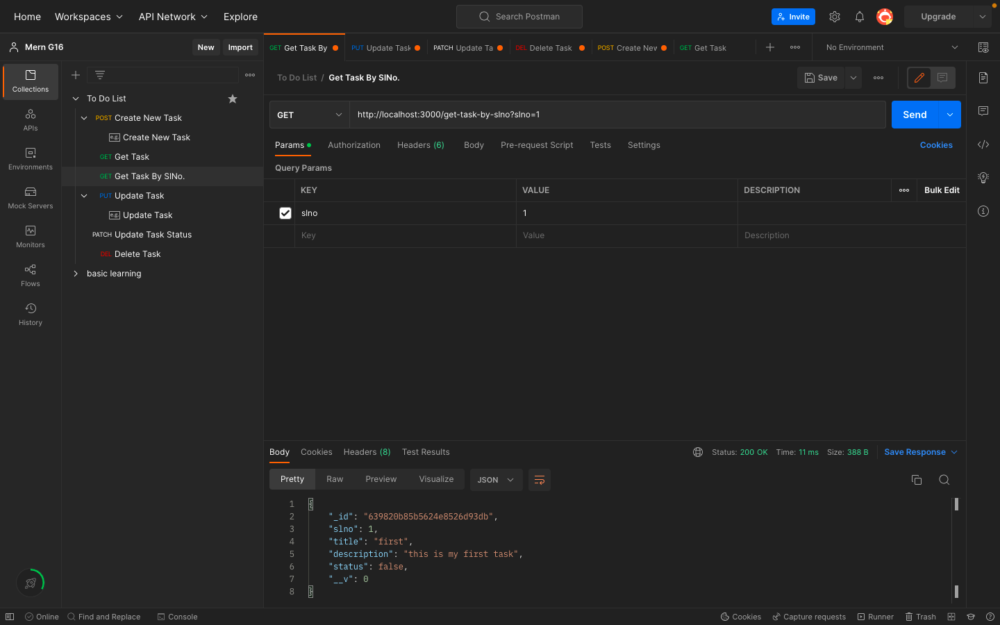
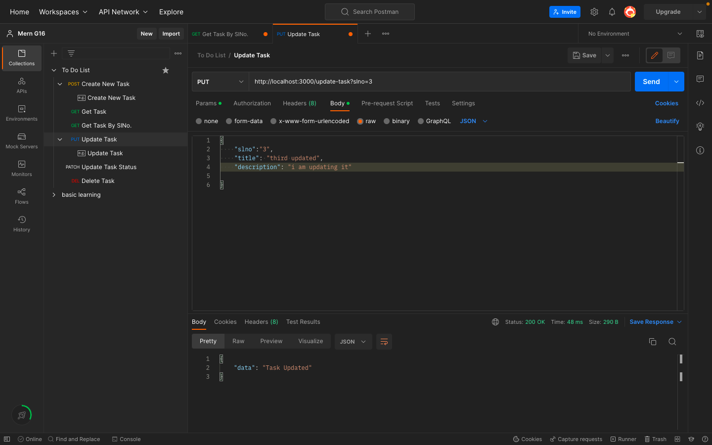
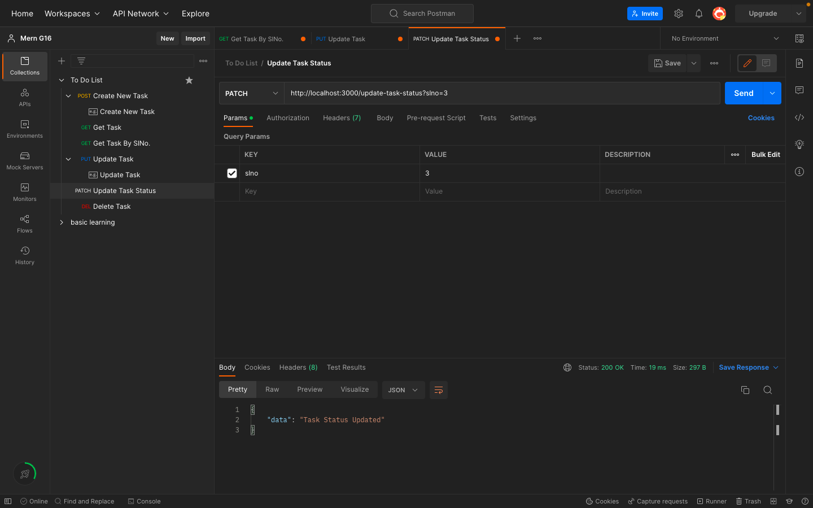
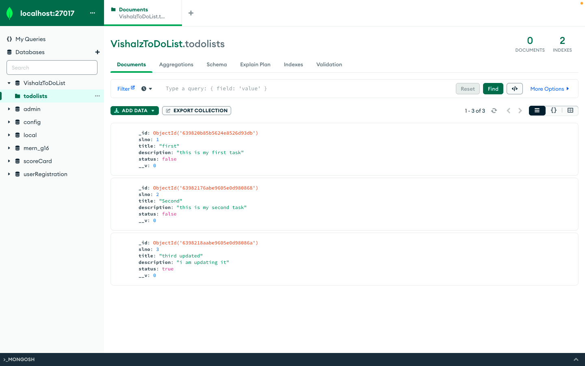
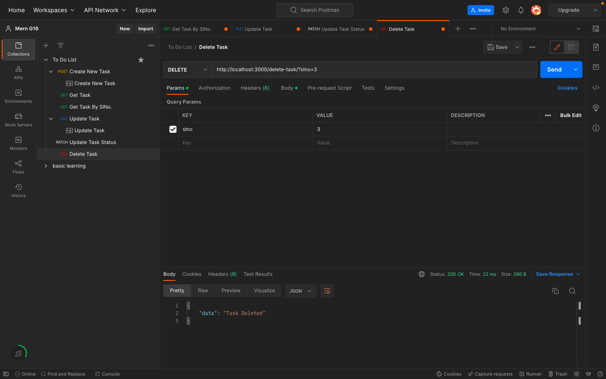
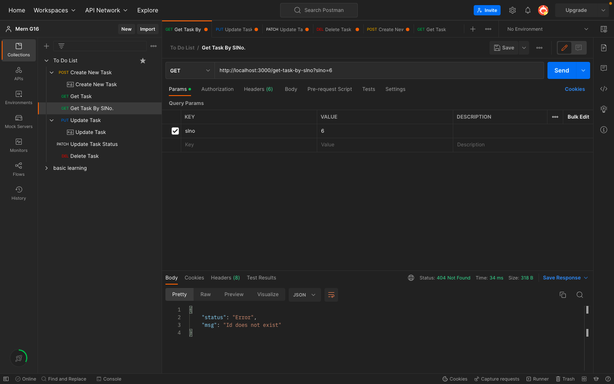
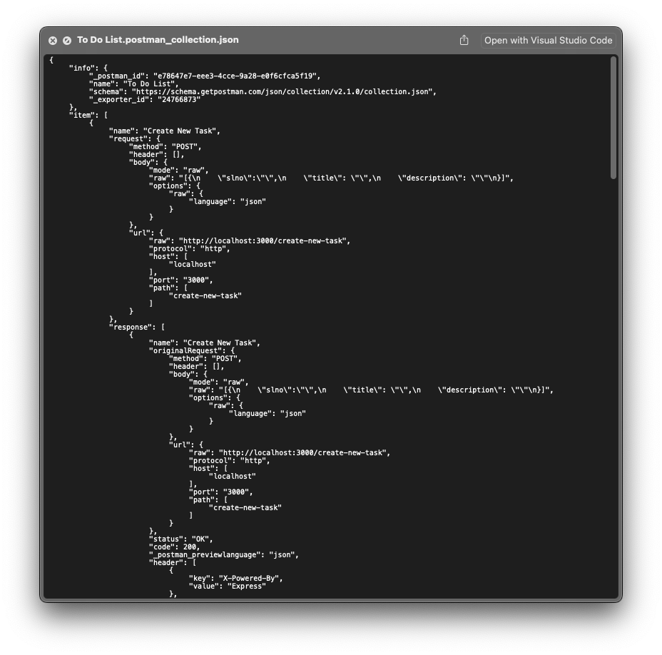

# TODO List
A very updated ToDoList in MERN STACK.

# Technology Used
NODE-JS, EXPRESS-JS, MongoDB, Mongoose, Postman

# Project Description
It's a TodoList where user can add unlimited number of things. They can edit it and check the status where it is updated or not and delete the items also.

# Project Features

1) It stores all the data in a MongoDb cluster so if you dont have mongodb on your local device it isn't such a issue.
2) It supports dual connectivity.
3) Add unlimted number of things to do.
4) View all your things to do collectively together.
5) Edit any entry in the list.
6) Check whether its updated or not.
7) Delete the entires once you have completed them.
8) It has unique serial number and validates it.
9) You can search a specific serial number.
10) It has all the postman commands attached so you dont have to worry how to pass the queries.

# How to start the Project

```
npm install node
npm run dev
```
After that go to your postman app and import the commands and send the requests you want to.

# SCREENSHOTS
 CREATE TASK


 VIEW TASKS


 DATABASE

 
 VIEW SPECIFIC TASK


 UPDATE TASK


 UPDATE TASK STATUS


 UPDATED DATABASE


 DELETE A TASK


 Error


 POSTMAN Json Files


## Copyright and License

Copyright (c) 2021-2022, Vishal Sharma, Chitkara University.

This project is licensed under the [MIT License](LICENSE.md).


